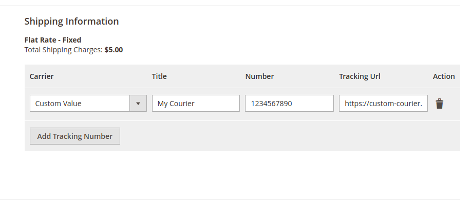
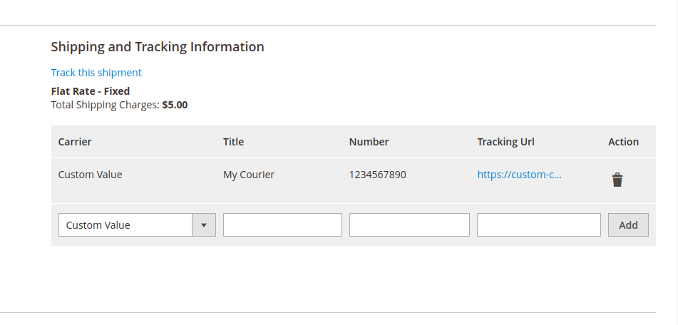

# Xtendable_CustomTrackingUrl

Custom tracking url.

@version 1.0.0, last modified May 2023

@author Didi Kusnadi <jalapro08@gmail.com>

@link https://www.linkedin.com/in/didi-kusnadi-35862394

---

You might need put custom tracking url but unfortunately your magento can't integrate with 3rd party tracking system.

You can put any url along side tracking number during create shipment in admin dashboard and show it to your customer.

If you love this extension [buy me a coffee](https://paypal.me/jalapro?country.x=ID&locale.x=id_ID)

Contact me through [linkedin](https://www.linkedin.com/in/didi-kusnadi-35862394) for another great extension

## Usage

## Change Log

##### Version 1.0

-   Initial release
